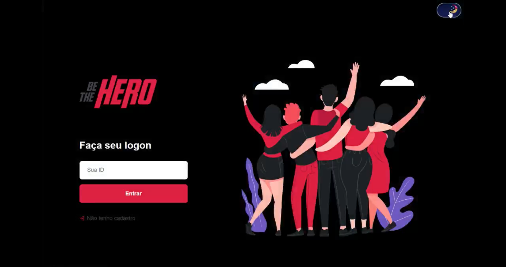

<h1 align="center">

</h1>

<h3 align="center">
<strong>The application under development is a fictional application for ONG</strong>
</h3>  
<br />

<p align="center">
  <a href="#rocket-technologies">Technologies</a>&nbsp;&nbsp;&nbsp;|&nbsp;&nbsp;&nbsp;
  <a href="#information_source-how-to-use">How To Use</a>&nbsp;&nbsp;&nbsp;|&nbsp;&nbsp;&nbsp;
</p>

<p align="center">
  
</p>

<p align="center">
  <a href="https://insomnia.rest/run/?label=BeTheHero&uri=https%3A%2F%2Fgithub.com%2Fmesquini%2Fbethehero%2Fedit%2Fmaster%2Fbe-the-hero.json" target="_blank"></a>
</p>

## :rocket: Technologies

This project was developed to studying JSON and React with the following technologies:

- [Yarn][yarn]
- [Nodemon](https://github.com/remy/nodemon)
- [Express](https://github.com/expressjs/express)
- [Sucrase](https://github.com/alangpierce/sucrase)
- [knex](https://github.com/knex/knex)
- [sqlite3](https://github.com/mapbox/node-sqlite3)
- [celebrate](https://github.com/)
- [cors](https://github.com/expressjs/cors)
- [Insomnia](https://insomnia.rest/download/)
- [VS Code][vc]

## :information_source: How To Use

```bash
# Clone this repository
$ git clone https://github.com/mesquini/be-the-hero

> cd be-the-hero
> cd backend
> yarn
> yarn dev

> cd frontend
> yarn
> yarn start
```

---

Made with ♥ by Victor Mesquini :wave: [Get in touch!](https://www.linkedin.com/in/mesquini/)

[nodejs]: https://nodejs.org/
[yarn]: https://yarnpkg.com/
[vc]: https://code.visualstudio.com/
